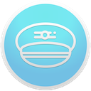

# Pilot (macOS)
[](https://travis-ci.org/RohanNagar/pilot-macos)
[](https://coveralls.io/github/RohanNagar/pilot-osx?branch=master)

[](http://twitter.com/RohanNagar22)

Pilot is a cloud-management application for macOS. Combine your files from Dropbox, Google Drive, Facebook, and more all in one location!

* [Supported Platforms](https://github.com/RohanNagar/pilot-osx/wiki/Platform-Support)
* [Building Locally](#building-locally)

## Building Locally
- Requirements
  - Xcode 8.3 (Swift 3.1)

First, fork this repo on GitHub. Then, clone your forked repo onto your machine.

```bash
$ git clone YOUR-FORK-URL
```

Open up the project in Xcode. Open the `Pilot.xcworkspace` file, *not* the `Pilot.xcproject` file. Press the play button at the top left of the Xcode window to build and then launch the application.

> Note: CocoaPods is not required to be installed, as the `Pods/` directory is included in the repo. If you wish to update or add new dependencies, you must [install CocoaPods](https://guides.cocoapods.org/using/getting-started.html).

